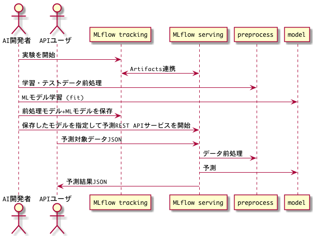

# MLflowでらくらく前処理・機械学習・予測API一連化

MLflow で実験のパラメータ、メトリックや学習済みモデルの記録については、情報が豊富に見つかりますが、しかし前処理と学習・予測を一連の処理としてパイプライン化する、分かりやすい簡単なサンプルが見つからなかったので、作ってみました。

よって、このサンプルでは、前処理と学習・予測のパイプライン化に重点を置きます。
また、予測サービス(REST)をAzureMLなどに簡単に立ち上げられることについても少し触れます。

ソースコードはこちら
https://github.com/vochicong/automl

---



---

# 概要

* データ: [タイタニック号乗客の生存](https://web.stanford.edu/class/archive/cs/cs109/cs109.1166/stuff/titanic.csv)
* [Pandas](https://pandas.pydata.org/)で前処理
* [H2O AutoML](http://docs.h2o.ai/h2o/latest-stable/h2o-docs/automl.html?highlight=automl)や[AutoGluon](https://github.com/awslabs/autogluon)で機械学習
* [MLflow custom model](https://mlflow.org/docs/latest/models.html#example-saving-an-xgboost-model-in-mlflow-format)で前処理と学習・予測をつなげる :notes:
* [MLflow models serve](https://mlflow.org/docs/latest/models.html#deploy-mlflow-models)で予測RESTサービス

---

# 開発環境の準備

[Conda](https://docs.conda.io/en/latest/miniconda.html)で環境作成

``` bash
make devenv
```

なお、 Python や各種ライブラリのバージョンによっては `mlflow serving` で予測するときと、
mlflowの保存済みモデルで予測するときとで、予測結果（確率）に差異が見られるので注意が必要です。

---

# データ前処理

試しに Age, Fareの Min-Maxスケーリング

``` bash
make preproc
```

---

# AutoML で自動学習

## H2OAutoML で学習

``` bash
make train_h2o
```

## AutoGluon で学習

``` bash
make train_autogluon
```

---

# 予測APIサービスの起動

デフォルトで5000番ポートが使われます。

``` bash
make -f Makefile.trained serve
```

または、 予測API用MLflow Dockerイメージを作れます。

``` bash
make -f Makefile.trained build_docker serve_docker
```

## 上記サービスに対するテスト

``` bash
make -f Makefile.trained test
```

同じテストデータに対して、APIを使って予測させる場合と、
モデルを直接ロードして予測させる場合とを比較して、
同じ予測結果になることを確認します

---

# AzureML への予測サービスデプロイ

## AzureML への予測モデル登録 & エンドポイントデプロイ

``` bash
make -f Makefile.trained azureml_deploy
```

## 上記サービスに対するテスト

``` bash
make -f Makefile.trained test_azureml_deploy
```

---

# 参考）APIのJSON形式

Request

``` json
{ "columns": [ "x1", "x2", "x3" ],
  "data": [
               [ 3,    2,    5 ],
               [ 1,    4,    8 ] ] }
```

Response（分類問題）

分類の確率

``` json
[ 0.7, 0.6 ]
```
